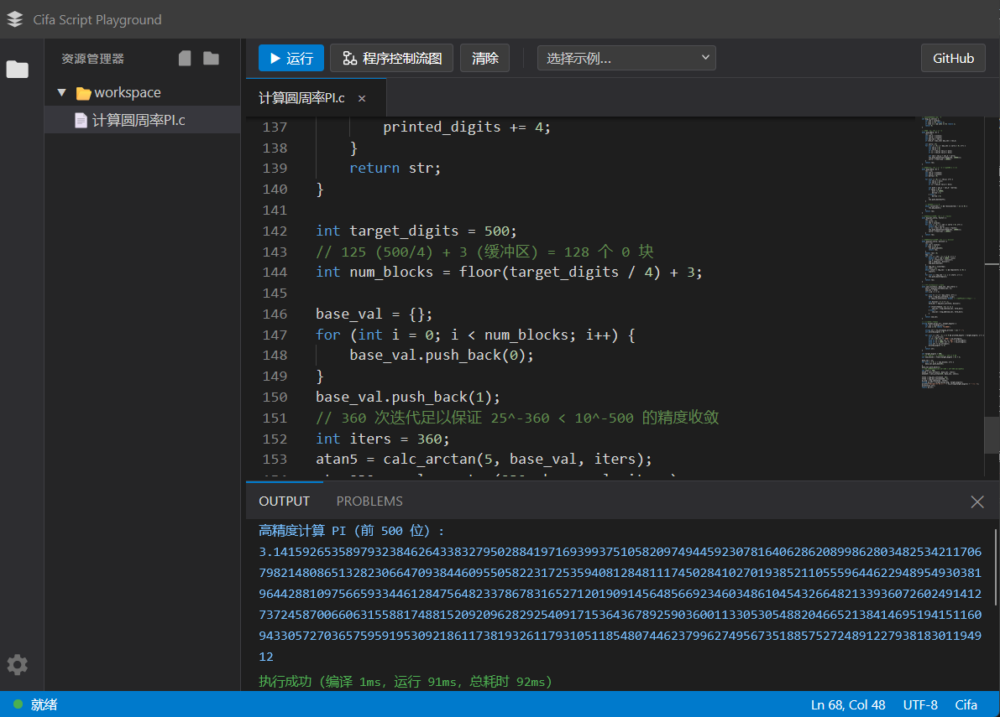
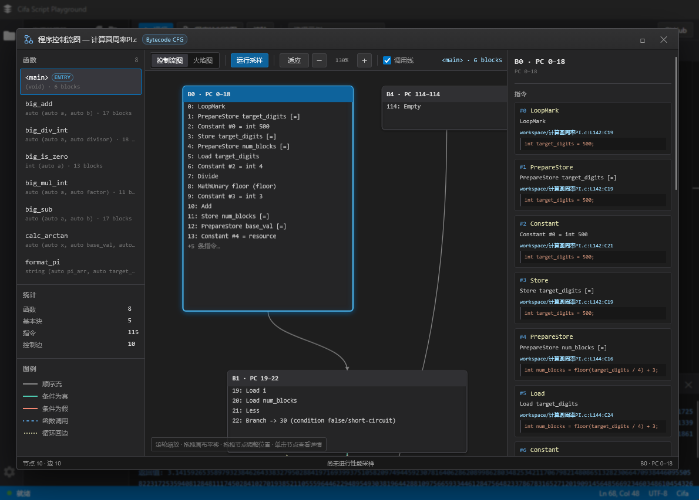

# Cifa Script Playground

Cifa 脚本引擎的 Web 在线解释器，网站地址是： [https://whyb.github.io/cifa.js/playground/web](https://whyb.github.io/cifa.js/playground/web)
[](https://whyb.github.io/cifa.js/playground/web)
[](https://whyb.github.io/cifa.js/playground/web)

## 缘起与致敬

这个项目的诞生，源于一次对“极简”的极致追求。

在寻找一种能够灵活表达**视频特效处理 Pipeline** 的轻量级脚本时，我偶然间闯入了超级牛逼的复刻版金庸群侠传(kys-cpp)作者的后宫群中，发现作者大大早在很久以前就实现了一个类C语法的脚本解释器 [cifa](https://github.com/scarsty/cifa) 仓库。

初读Cifa的设计与实现，我唯有对原作者 **[@scarsty](https://github.com/scarsty)** 表达*五体投地*的由衷佩服，之后有段时间我也有微薄的给源Cifa贡献了do while的实现和一些单元测试不值一提，惊叹Cifa在如此精简的代码体量下，展现出了令人惊叹的逻辑美感与工程智慧。令人扼腕的是，这样一个极其优秀的项目，至今仍处于“大隐隐于市”的状态，未被世间所了解或采用，完全被低估和埋没了，所以我决定做点啥。

**本项目存在的目的：**

1.  **致敬**: 向原作者 [@scarsty](https://github.com/scarsty) 这种纯粹的匠心精神致敬，让更多人看到 Cifa 的光芒。
2.  **生产力**: Cifa Script Playground 提供一个即开即用的 IDE 环境，方便开发者编写 Cifa 脚本并实时观测运行结果。

-----

## 功能特性

  - **Monaco Editor**: 采用 VS Code 同款内核，支持 Cifa 语法高亮（含 0x/0b/0 进制字面量、goto 等）。
  - **实时 Linting**: 编码过程中即时识别并标注语法/静态错误（红波浪线）。基于引擎的 compile_script 纯编译检查，不执行脚本，更安全、更快。
  - **64 位整数精度**: int/char 按 64 位整数存储，Web 返回值使用十进制字符串传递，避免超出 JavaScript 安全整数范围后精度丢失。
  - **多文件 #include**: 以当前编辑文件为入口执行/检查，入口文件所在目录自动加入 #include 搜索路径，子目录之间的相对引用也能正确解析。
  - **Web Worker 隔离执行**: 脚本运行于后台独立线程，即便代码出现逻辑瑕疵也不会阻塞 UI 响应。
  - **VS 风格错误列表**: 底部集成专业错误汇总看板，双击错误项即可自动跳转定位至源码行。
  - **字节码程序控制流图**: 在运行按钮旁打开 VS Code 风格子窗口，查看完整字节码 CFG，支持缩放、平移、节点拖拽、函数切换和指令详情。
  - **运行时采样与火焰图**: CFG 窗口可按需执行性能采样，显示函数、基本块、指令和控制边耗时，并生成可交互 Flamegraph。
  - **运行安全保护**: 内置循环计数与递归深度限制，有效预防死循环导致的系统挂起。

关于Cifa脚本语法的更多信息参见： [cifa仓库](https://github.com/scarsty/cifa)

## 引擎 API 同步说明

本仓库的 Cifa 引擎已升级为「字节码编译/执行分离」架构，Web 端对应的同步点如下：

- **新 API**：
  - `bool compile_script(script)` / `bool compile_file(filename)`：只编译为字节码，不执行。
  - `Object run(entry_label = "")`：执行已编译的字节码；可指定顶层标签作为入口。
  - `run_script` / `run_file` 现在是 `compile_*` + `run` 的组合调用。
- **Lint 变纯静态检查**：`lint` / `lintWithFiles` 改用 `compile_script` / `compile_file`，只报告语法与静态错误，不再真正执行脚本。
- **CFG 导出**：`getProgramCfg` / `getProgramCfgWithFiles` 返回由真实字节码生成的基本块、指令和标准控制流边，不执行脚本。
- **性能采样**：`executeWithProfile` / `executeWithFilesWithProfile` 在普通执行结果上附带函数、指令、控制边和火焰图调用栈数据。
- **多文件执行**：`executeWithFiles` / `lintWithFiles` 先把编辑器最新内容写入 VFS 的 /workspace 并覆盖入口文件，再以入口文件路径调用 `compile_file`/`run`，入口文件所在目录自动参与 #include 搜索。
- **错误定位增强**：错误信息携带文件名（如 /workspace/sub/main.c）与出错行源码文本，Problems 面板会显示源码行，点击错误项可跨文件跳转到对应标签页。
- **脚本语言新特性**：
  - 十六进制 `0xFF`、二进制 `0b1010`、八进制 `077`（前导 0）字面量。
  - `sprintf`（printf 风格格式化字符串），支持 `%lld` 等 64 位整数格式。
  - `int`/`char` 使用 64 位整数存储，`float` 与 `double` 统一按双精度浮点存储。
  - 新增 `register_type<T>(name)`、注册类型名称查询及用户自定义运算符回调，宿主可扩展类型转换与运算。
  - 函数/结构体定义必须位于全局作用域（否则编译报错）。
  - 注册函数/参数/向量/用户数据时会校验名称合法性。
- **内置函数列表**已同步补充：`sprintf`、`format`、`to_number`、`type`、`random`、`exit`、`run_string`、`run_file` 等。

## 本地构建步骤

### 1. 激活 Emscripten 环境

```bash
# 确保你的环境已配置好 wasm 编译链
conda activate wasm
```

### 2. 编译 Wasm 模块

进入 WebAssembly 目录执行构建脚本：

```bash
cd playground/wasm
build.bat
```

### 3. 启动本地服务器

进入 Web 目录并启动静态服务：

```bash
cd playground/web
python -m http.server 8080
```

### 4. 访问

打开浏览器访问：`http://localhost:8080`

## 浏览器兼容性

本工具依赖现代 Web 技术栈，需确保浏览器支持 **WebAssembly** 与 **Web Worker**：

  * Chrome 80+
  * Firefox 75+
  * Edge 80+
  * Safari 14+
